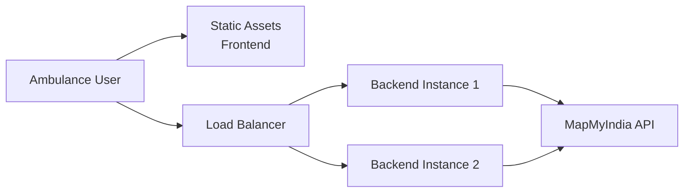

# Design Document: Smart Ambulance Route Finder

## Overview

The Smart Ambulance Route Finder is a full-stack web application consisting of a React frontend and Node.js/Express backend. The system integrates with MapMyIndia APIs to provide real-time, traffic-aware routing for ambulances in India. The architecture prioritizes security (API keys on backend only), scalability (stateless design), and resilience (fallback mechanisms for API failures).

### Key Design Decisions

1. **Backend-Proxied API Calls**: All MapMyIndia API requests go through the backend to protect API keys and enable caching/rate limiting
2. **Leaflet + OpenStreetMap**: Chosen for its lightweight nature, extensive plugin ecosystem, and free tier
3. **Stateless Architecture**: No session storage on backend, enabling horizontal scaling
4. **Fallback Demo Data**: Hardcoded hospital datasets for metro cities when API fails
5. **Polling-Based Route Updates**: 60-second intervals during navigation to detect traffic changes
6. **Client-Side Animation**: Ambulance movement animated on frontend for smooth UX without constant backend calls

## Architecture

### System Architecture Diagram

```mermaid
graph TB
    subgraph "Frontend - React SPA"
        UI[User Interface]
        MapComp[Map Component<br/>Leaflet]
        LocServ[Location Service]
        NavEng[Navigation Engine]
        APIClient[API Client<br/>Fetch]
    end
    
    subgraph "Backend - Node.js/Express"
        API[Express Server]
        HospRoute[/hospitals endpoint]
        RouteCalc[/route endpoint]
        Cache[Response Cache]
        RateLimit[Rate Limiter]
    end
    
    subgraph "External Services"
        MMI[MapMyIndia API]
        GPS[Browser GPS]
    end
    
    UI --> MapComp
    UI --> LocServ
    UI --> NavEng
    LocServ --> GPS
    MapComp --> APIClient
    NavEng --> APIClient
    APIClient --> API
    API --> RateLimit
    RateLimit --> HospRoute
    RateLimit --> RouteCalc
    HospRoute --> Cache
    RouteCalc --> Cache
    Cache --> MMI
    HospRoute --> MMI
    RouteCalc --> MMI
```

### Technology Stack

**Frontend:**
- React 18+ (functional components with hooks)
- Leaflet 1.9+ with React-Leaflet wrapper
- OpenStreetMap tiles (free tier)
- CSS3 with Flexbox/Grid for responsive layout
- Fetch API for HTTP requests

**Backend:**
- Node.js 18+ LTS
- Express 4.x
- dotenv for environment configuration
- cors middleware
- node-cache for in-memory caching
- express-rate-limit for API protection

**APIs:**
- MapMyIndia Place API (geocoding/search)
- MapMyIndia Nearby API (hospital discovery)
- MapMyIndia Directions API (routing with traffic)

### Deployment Architecture



## Components and Interfaces

### Frontend Components

#### 1. App Component (Root)
**Responsibility**: Application state management and component orchestration

**State:**
```typescript
interface AppState {
  ambulanceLocation: {lat: number, lng: number} | null;
  selectedHospital: Hospital | null;
  emergencyType: EmergencyType | null;
  hospitals: Hospital[];
  routes: {best: Route, traffic: Route} | null;
  navigationActive: boolean;
  currentPosition: {lat: number, lng: number} | null;
  error: string | null;
  loading: boolean;
}
```

**Key Methods:**
- `handleLocationDetected(lat, lng)`: Validates and stores ambulance location
- `handleEmergencyTypeSelected(type)`: Stores emergency classification
- `handleHospitalSelected(hospital)`: Triggers route calculation
- `handleStartNavigation()`: Activates navigation mode
- `handleArrival()`: Completes navigation and resets state

#### 2. LocationInput Component
**Responsibility**: GPS detection and manual location entry

**Props:**
```typescript
interface LocationInputProps {
  onLocationDetected: (lat: number, lng: number) => void;
  onError: (error: string) => void;
}
```

**Implementation:**
- Uses `navigator.geolocation.getCurrentPosition()` for GPS
- Validates coordinates against India bounds (8-37°N, 68-97°E)
- Provides text inputs for manual lat/lng entry
- Integrates MapMyIndia Place API for place name search

#### 3. EmergencyTypeSelector Component
**Responsibility**: Emergency classification dropdown

**Props:**
```typescript
interface EmergencyTypeSelectorProps {
  onSelect: (type: EmergencyType) => void;
  disabled: boolean;
}

type EmergencyType = 
  | "Road Accident"
  | "Cardiac Emergency"
  | "Trauma"
  | "Fire Injury"
  | "Pregnancy Emergency";
```

#### 4. MapView Component
**Responsibility**: Map rendering, markers, and route visualization

**Props:**
```typescript
interface MapViewProps {
  ambulanceLocation: {lat: number, lng: number} | null;
  hospitals: Hospital[];
  selectedHospital: Hospital | null;
  routes: {best: Route, traffic: Route} | null;
  currentPosition: {lat: number, lng: number} | null;
  onHospitalClick: (hospital: Hospital) => void;
}
```

**Features:**
- Renders Leaflet map with OpenStreetMap tiles
- Custom ambulance marker (🚑 icon)
- Custom hospital markers (🏥 icon)
- Blue polyline for best route
- Red polyline for traffic route
- Auto-fit bounds to show all markers and routes
- Traffic legend overlay

#### 5. NavigationPanel Component
**Responsibility**: Turn-by-turn directions and navigation controls

**Props:**
```typescript
interface NavigationPanelProps {
  routes: {best: Route, traffic: Route} | null;
  navigationActive: boolean;
  remainingDistance: number;
  remainingTime: number;
  currentInstruction: string;
  onStartNavigation: () => void;
  onStopNavigation: () => void;
}
```

**Display:**
- Route summary (distance, ETA)
- "Start Emergency Route" button
- Current turn instruction
- Remaining distance/time during navigation
- Emergency alert banner when active

#### 6. EmergencyAlert Component
**Responsibility**: Prominent alert display during navigation

**Props:**
```typescript
interface EmergencyAlertProps {
  active: boolean;
}
```

**Styling:**
- Fixed position at top of viewport
- Red/orange gradient background
- Large, bold text
- Pulsing animation for visibility

### Backend API Endpoints

#### 1. GET /hospitals
**Purpose**: Discover nearby hospitals

**Query Parameters:**
```typescript
interface HospitalsQuery {
  lat: number;
  lng: number;
  radius?: number; // default: 10000 (10km)
}
```

**Response:**
```typescript
interface HospitalsResponse {
  success: boolean;
  hospitals: Hospital[];
  source: "api" | "fallback";
}

interface Hospital {
  id: string;
  name: string;
  lat: number;
  lng: number;
  address: string;
  distance: number; // meters from ambulance
}
```

**Implementation:**
1. Validate lat/lng parameters
2. Call MapMyIndia Nearby API with category "hospital"
3. If API fails or returns empty, use fallback demo data
4. Calculate distance from ambulance to each hospital
5. Sort by distance (nearest first)
6. Cache results for 5 minutes (hospitals don't move)
7. Return top 10 hospitals

**Fallback Data Structure:**
```javascript
const DEMO_HOSPITALS = {
  bangalore: [
    {id: "1", name: "Manipal Hospital", lat: 12.9716, lng: 77.5946, address: "HAL Airport Rd"},
    {id: "2", name: "Apollo Hospital", lat: 12.9698, lng: 77.7499, address: "Bannerghatta Rd"},
    // ... more hospitals
  ],
  delhi: [...],
  hyderabad: [...]
};
```

#### 2. POST /route
**Purpose**: Calculate optimal route with traffic awareness

**Request Body:**
```typescript
interface RouteRequest {
  ambulance_lat: number;
  ambulance_lng: number;
  hospital_lat: number;
  hospital_lng: number;
  emergency_type: EmergencyType;
}
```

**Response:**
```typescript
interface RouteResponse {
  success: boolean;
  best_route: RouteDetails;
  traffic_route: RouteDetails;
}

interface RouteDetails {
  polyline: string; // encoded polyline
  coordinates: Array<{lat: number, lng: number}>; // decoded
  distance_km: number;
  duration_min: number;
  traffic_level: "low" | "medium" | "high";
  instructions: TurnInstruction[];
}

interface TurnInstruction {
  text: string;
  distance: number;
  duration: number;
}
```

**Implementation:**
1. Validate request body parameters
2. Call MapMyIndia Directions API with:
   - `alternatives=true` (get multiple routes)
   - `traffic=true` (include traffic data)
   - `steps=true` (get turn-by-turn instructions)
3. Receive 2-3 alternative routes
4. Analyze each route:
   - Calculate traffic_level based on duration vs distance ratio
   - Score = (duration_min / distance_km)
   - Low: score < 2, Medium: 2-3, High: > 3
5. Select best_route: lowest duration_min
6. Select traffic_route: highest traffic_level (for comparison)
7. Decode polylines to coordinate arrays
8. Cache results for 2 minutes (traffic changes)
9. Return both routes

**MapMyIndia Directions API Call:**
```javascript
const url = `https://apis.mapmyindia.com/advancedmaps/v1/${API_KEY}/route_adv/driving/${ambulance_lng},${ambulance_lat};${hospital_lng},${hospital_lat}?alternatives=true&steps=true&overview=full`;
```

#### 3. GET /health
**Purpose**: Health check for monitoring

**Response:**
```typescript
interface HealthResponse {
  status: "ok";
  timestamp: string;
  uptime: number;
}
```

### Data Models

#### Hospital Model
```typescript
interface Hospital {
  id: string;              // Unique identifier
  name: string;            // Hospital name
  lat: number;             // Latitude
  lng: number;             // Longitude
  address: string;         // Full address
  distance: number;        // Distance from ambulance (meters)
  phone?: string;          // Contact number (optional)
  emergency_services: boolean; // Has emergency dept
}
```

#### Route Model
```typescript
interface Route {
  polyline: string;                    // Encoded polyline string
  coordinates: Coordinate[];           // Decoded lat/lng pairs
  distance_km: number;                 // Total distance
  duration_min: number;                // Estimated time
  traffic_level: TrafficLevel;         // Congestion assessment
  instructions: TurnInstruction[];     // Step-by-step directions
}

interface Coordinate {
  lat: number;
  lng: number;
}

type TrafficLevel = "low" | "medium" | "high";

interface TurnInstruction {
  text: string;           // "Turn right onto MG Road"
  distance: number;       // Distance to next turn (meters)
  duration: number;       // Time to next turn (seconds)
  maneuver: string;       // "turn-right", "straight", etc.
}
```

#### Navigation State Model
```typescript
interface NavigationState {
  active: boolean;
  route: Route;
  currentSegmentIndex: number;        // Which instruction we're on
  currentPosition: Coordinate;        // Animated position
  remainingDistance: number;          // Meters to destination
  remainingTime: number;              // Minutes to destination
  lastUpdate: Date;                   // Last position update
  routeRecalcTimer: NodeJS.Timer;    // Polling timer
}
```

### Service Layer

#### LocationService
**Responsibility**: GPS and location validation

**Methods:**
```typescript
class LocationService {
  // Request GPS permission and get current position
  async getCurrentPosition(): Promise<Coordinate>;
  
  // Validate coordinates are within India
  validateIndianLocation(lat: number, lng: number): boolean;
  
  // Search for place by name using MapMyIndia
  async searchPlace(query: string): Promise<Coordinate>;
  
  // Calculate distance between two points (Haversine formula)
  calculateDistance(point1: Coordinate, point2: Coordinate): number;
}
```

**India Bounds Validation:**
```javascript
const INDIA_BOUNDS = {
  minLat: 8.0,
  maxLat: 37.0,
  minLng: 68.0,
  maxLng: 97.0
};

function validateIndianLocation(lat, lng) {
  return lat >= INDIA_BOUNDS.minLat && 
         lat <= INDIA_BOUNDS.maxLat &&
         lng >= INDIA_BOUNDS.minLng && 
         lng <= INDIA_BOUNDS.maxLng;
}
```

#### APIClient
**Responsibility**: HTTP communication with backend

**Methods:**
```typescript
class APIClient {
  private baseURL: string;
  
  // Fetch nearby hospitals
  async getHospitals(lat: number, lng: number): Promise<Hospital[]>;
  
  // Calculate route
  async calculateRoute(
    ambulanceLat: number,
    ambulanceLng: number,
    hospitalLat: number,
    hospitalLng: number,
    emergencyType: EmergencyType
  ): Promise<{best: Route, traffic: Route}>;
  
  // Generic fetch with error handling
  private async fetch<T>(endpoint: string, options?: RequestInit): Promise<T>;
}
```

**Error Handling:**
```javascript
async fetch(endpoint, options) {
  try {
    const response = await fetch(`${this.baseURL}${endpoint}`, {
      ...options,
      headers: {
        'Content-Type': 'application/json',
        ...options?.headers
      },
      timeout: 10000 // 10 second timeout
    });
    
    if (!response.ok) {
      throw new Error(`HTTP ${response.status}: ${response.statusText}`);
    }
    
    return await response.json();
  } catch (error) {
    console.error(`API Error: ${endpoint}`, error);
    throw error;
  }
}
```

#### NavigationEngine
**Responsibility**: Route following and position updates

**Methods:**
```typescript
class NavigationEngine {
  private state: NavigationState;
  
  // Start navigation along route
  startNavigation(route: Route, startPosition: Coordinate): void;
  
  // Stop navigation
  stopNavigation(): void;
  
  // Update ambulance position (called by animation timer)
  updatePosition(newPosition: Coordinate): void;
  
  // Calculate remaining distance and time
  calculateRemaining(): {distance: number, time: number};
  
  // Get current turn instruction
  getCurrentInstruction(): TurnInstruction;
  
  // Check if arrived at destination
  checkArrival(destination: Coordinate): boolean;
  
  // Poll backend for route updates
  private async pollRouteUpdates(): Promise<void>;
}
```

**Position Animation Algorithm:**
```javascript
// Animate ambulance along route polyline
function animatePosition(route, onUpdate) {
  let currentIndex = 0;
  const coordinates = route.coordinates;
  const totalPoints = coordinates.length;
  const intervalMs = 3000; // Update every 3 seconds
  
  const timer = setInterval(() => {
    if (currentIndex >= totalPoints - 1) {
      clearInterval(timer);
      return;
    }
    
    currentIndex++;
    const newPosition = coordinates[currentIndex];
    onUpdate(newPosition);
    
    // Check if we should recalculate route (every 20 updates = 60 seconds)
    if (currentIndex % 20 === 0) {
      recalculateRoute(newPosition);
    }
  }, intervalMs);
  
  return timer;
}
```

**Arrival Detection:**
```javascript
function checkArrival(currentPos, destination) {
  const distance = calculateDistance(currentPos, destination);
  return distance < 50; // Within 50 meters
}
```

### Backend Implementation Details

#### Server Setup
```javascript
// server.js
const express = require('express');
const cors = require('cors');
const rateLimit = require('express-rate-limit');
require('dotenv').config();

const app = express();

// Middleware
app.use(cors());
app.use(express.json());

// Rate limiting: 100 requests per 15 minutes per IP
const limiter = rateLimit({
  windowMs: 15 * 60 * 1000,
  max: 100
});
app.use('/api/', limiter);

// Routes
app.get('/api/hospitals', hospitalsController);
app.post('/api/route', routeController);
app.get('/api/health', healthController);

// Serve frontend in production
if (process.env.NODE_ENV === 'production') {
  app.use(express.static('build'));
  app.get('*', (req, res) => {
    res.sendFile(path.join(__dirname, 'build', 'index.html'));
  });
}

const PORT = process.env.PORT || 5000;
app.listen(PORT, () => console.log(`Server running on port ${PORT}`));
```

#### Caching Strategy
```javascript
const NodeCache = require('node-cache');

// Hospital cache: 5 minutes TTL
const hospitalCache = new NodeCache({ stdTTL: 300 });

// Route cache: 2 minutes TTL (traffic changes)
const routeCache = new NodeCache({ stdTTL: 120 });

function getCacheKey(lat, lng, type = 'hospital') {
  // Round to 3 decimal places (~100m precision)
  const roundedLat = Math.round(lat * 1000) / 1000;
  const roundedLng = Math.round(lng * 1000) / 1000;
  return `${type}:${roundedLat},${roundedLng}`;
}
```

#### MapMyIndia API Integration
```javascript
const axios = require('axios');
const API_KEY = process.env.MAPMYINDIA_API_KEY;

async function fetchNearbyHospitals(lat, lng, radius = 10000) {
  const url = `https://atlas.mapmyindia.com/api/places/nearby/json`;
  
  try {
    const response = await axios.get(url, {
      params: {
        keywords: 'hospital',
        refLocation: `${lat},${lng}`,
        radius: radius,
        page: 1
      },
      headers: {
        'Authorization': `Bearer ${API_KEY}`
      },
      timeout: 8000
    });
    
    return response.data.suggestedLocations || [];
  } catch (error) {
    console.error('MapMyIndia API Error:', error.message);
    return null; // Trigger fallback
  }
}

async function fetchDirections(startLat, startLng, endLat, endLng) {
  const url = `https://apis.mapmyindia.com/advancedmaps/v1/${API_KEY}/route_adv/driving/${startLng},${startLat};${endLng},${endLat}`;
  
  try {
    const response = await axios.get(url, {
      params: {
        alternatives: true,
        steps: true,
        overview: 'full',
        geometries: 'polyline'
      },
      timeout: 8000
    });
    
    return response.data.routes || [];
  } catch (error) {
    console.error('Directions API Error:', error.message);
    throw new Error('Route calculation failed');
  }
}
```


## Correctness Properties

*A property is a characteristic or behavior that should hold true across all valid executions of a system—essentially, a formal statement about what the system should do. Properties serve as the bridge between human-readable specifications and machine-verifiable correctness guarantees.*

### Property Reflection

After analyzing all acceptance criteria, I identified the following consolidations to eliminate redundancy:

**Consolidated Properties:**
1. Location validation (1.3, 2.5, 13.1, 13.2, 13.3) → Single comprehensive India bounds validation property
2. Error handling (1.4, 13.3, 13.4) → Single property for invalid location rejection
3. Hospital display information (4.5, 6.4) → Single property for required data display
4. API response format (5.6, 11.7) → Single property for JSON response structure
5. Polyline encoding/decoding (6.1) → Round-trip property

**Removed Duplicates:**
- 2.5 (duplicate of 1.3)
- 2.6 (duplicate of 1.5)
- 13.1, 13.2 (covered by comprehensive 1.3)
- 15.7, 16.2 (duplicate of 4.3)

### Properties

#### Property 1: India Location Validation
*For any* pair of latitude and longitude coordinates, the Location_Service validation should return true if and only if the latitude is between 8° and 37° North AND the longitude is between 68° and 97° East.

**Validates: Requirements 1.3, 2.5, 13.1, 13.2**

**Test Strategy:** Generate random coordinate pairs including edge cases (exactly on boundaries, just inside, just outside, far outside) and verify validation correctness.

---

#### Property 2: Invalid Location Rejection
*For any* coordinates outside India's boundaries, the Location_Service should reject the location and prevent any route calculation or hospital search operations from proceeding.

**Validates: Requirements 1.4, 13.3**

**Test Strategy:** Generate invalid coordinates and verify that subsequent operations (hospital search, route calculation) are blocked.

---

#### Property 3: Coordinate Input Validation
*For any* user input to the manual coordinate fields, the validation should accept only numeric values within the valid latitude range (-90 to 90) and longitude range (-180 to 180), rejecting all non-numeric or out-of-range inputs.

**Validates: Requirements 2.3**

**Test Strategy:** Generate various inputs (numbers, strings, special characters, boundary values) and verify validation behavior.

---

#### Property 4: Emergency Type State Persistence
*For any* emergency type selection from the dropdown, the application state should store and maintain that selection until explicitly changed or reset, and include it in all subsequent route calculation requests.

**Validates: Requirements 3.3**

**Test Strategy:** Select different emergency types and verify state persistence across component re-renders and API calls.

---

#### Property 5: Hospital Information Completeness
*For any* hospital displayed in the UI, the display should include all required fields: name, address, distance from ambulance, and coordinates, with no fields missing or undefined.

**Validates: Requirements 4.5, 6.4**

**Test Strategy:** Generate random hospital objects and verify all required fields are present in the rendered output.

---

#### Property 6: Single Hospital Selection
*For any* sequence of hospital selections, only the most recently selected hospital should be marked as selected, with all previously selected hospitals automatically deselected.

**Validates: Requirements 4.7**

**Test Strategy:** Simulate multiple hospital selections and verify only one is selected at any time.

---

#### Property 7: Best Route Selection
*For any* set of alternative routes returned by the API, the Route_Calculator should identify the route with the minimum duration_min value as the best_route, regardless of the order routes are received.

**Validates: Requirements 5.4**

**Test Strategy:** Generate random sets of routes with varying durations and verify the shortest is always selected.

---

#### Property 8: Route Response Completeness
*For any* successful route calculation, the response should include both best_route and traffic_route objects, each containing polyline, coordinates, distance_km, duration_min, and traffic_level fields with valid values.

**Validates: Requirements 5.6, 11.7**

**Test Strategy:** Mock various route API responses and verify all required fields are present and properly typed.

---

#### Property 9: Polyline Round-Trip Consistency
*For any* valid route polyline string, encoding a decoded polyline should produce a polyline that, when decoded, yields coordinates equivalent to the original decoded coordinates (within reasonable precision tolerance of 0.00001 degrees).

**Validates: Requirements 6.1**

**Test Strategy:** Generate random polylines, decode them, re-encode them, decode again, and verify coordinate equivalence.

---

#### Property 10: Arrival Detection Threshold
*For any* ambulance position during navigation, arrival should be detected if and only if the distance to the hospital destination is less than 50 meters, with no false positives above this threshold and no false negatives below it.

**Validates: Requirements 10.2**

**Test Strategy:** Generate positions at various distances from destination (45m, 49m, 50m, 51m, 100m) and verify arrival detection accuracy.

---

#### Property 11: System Reset Completeness
*For any* application state (regardless of what data is set), invoking the reset operation should clear all route data, hospital selection, emergency type, and navigation state, returning the system to the exact initial state as if freshly loaded.

**Validates: Requirements 10.7**

**Test Strategy:** Set various combinations of state (routes, hospitals, emergency types, navigation active) and verify reset clears everything.

---

#### Property 12: API Error Handling Universality
*For any* API request that fails (network error, timeout, 4xx/5xx response), the frontend should catch the error, display an appropriate error message to the user, and not crash or enter an invalid state.

**Validates: Requirements 12.4**

**Test Strategy:** Mock various API failure scenarios and verify graceful error handling for each.

---

#### Property 13: Loading Indicator Consistency
*For any* asynchronous operation (API call, GPS detection, route calculation), a loading indicator should be displayed from the moment the operation starts until it completes (success or failure), with no gaps or overlaps.

**Validates: Requirements 12.5**

**Test Strategy:** Track loading state during various async operations and verify indicator visibility matches operation lifecycle.

---

#### Property 14: Route Calculation for Valid Indian Locations
*For any* two valid coordinates within India's boundaries, the Route_Calculator should successfully calculate a route or return a descriptive error (e.g., "no road connection"), but never fail silently or crash.

**Validates: Requirements 15.2**

**Test Strategy:** Generate random pairs of valid Indian coordinates and verify route calculation completes with either success or explicit error.

---

#### Property 15: HTTP Status Code Correctness
*For any* backend API response, the HTTP status code should correctly reflect the outcome: 200 for success, 400 for invalid input, 404 for not found, 500 for server errors, and 503 for external API failures.

**Validates: Requirements 11.7, 16.7**

**Test Strategy:** Test various scenarios (valid requests, invalid inputs, API failures) and verify correct status codes.

---

### Edge Cases and Examples

The following criteria are best tested with specific examples rather than properties:

**GPS and Location (Examples):**
- Application requests GPS permission on load (1.1)
- GPS coordinates are retrieved when permission granted (1.2)
- Ambulance marker displays at detected location (1.5)
- Manual input UI shown when GPS unavailable (1.6)
- Place search queries MapMyIndia API (2.4)

**UI Elements (Examples):**
- Emergency type dropdown exists with all 5 types (3.1, 3.2)
- Emergency type required before route calculation (3.5)
- Hospital markers display on map (4.4)
- Hospital selection on marker click (4.6)
- Route polylines drawn in correct colors (6.2, 6.3)
- Map viewport auto-fits to show all elements (6.5)
- Traffic legend displayed (6.6)
- Route visibility toggle (6.7)

**Navigation (Examples):**
- "Start Emergency Route" button appears when route calculated (7.1)
- Navigation mode activated on button click (7.2)
- Navigation UI shows distance, ETA, directions (7.3, 7.4, 7.5)
- Ambulance marker animates along route (7.6)
- Position updates at regular intervals (7.7)
- Route polling every 60 seconds during navigation (8.1)
- Route updates when ETA changes significantly (8.3)
- Notification on route change (8.4)
- Emergency alert banner during navigation (9.1, 9.2, 9.4, 9.5)
- Navigation stops on arrival (10.3, 10.4)
- Arrival message displayed (10.5)
- Reset option provided on arrival (10.6)

**Backend API (Examples):**
- GET /hospitals endpoint with lat/lng parameters (11.3)
- POST /route endpoint with coordinates (11.4)
- CORS enabled (11.5)
- Environment variables for config (11.6)
- API keys not exposed to frontend (11.2)
- Fallback to demo hospitals when API fails (4.3)
- Rate limiting implemented (15.3)
- Response caching for hospitals (15.4)
- Request logging (15.6)

**Error Handling (Examples):**
- GPS failure shows error and manual input (16.1)
- Route calculation failure shows error and retry (16.3)
- Offline navigation continues with last route (16.4)
- Timeout errors displayed (16.5)
- Errors logged to console (16.6)

## Error Handling

### Error Categories and Strategies

#### 1. GPS and Location Errors
**Scenarios:**
- GPS permission denied
- GPS unavailable (no hardware)
- GPS timeout (taking too long)
- Invalid coordinates entered manually
- Location outside India

**Handling:**
```javascript
try {
  const position = await navigator.geolocation.getCurrentPosition();
  const {latitude, longitude} = position.coords;
  
  if (!validateIndianLocation(latitude, longitude)) {
    throw new Error('Location must be within India');
  }
  
  setAmbulanceLocation({lat: latitude, lng: longitude});
} catch (error) {
  if (error.code === error.PERMISSION_DENIED) {
    setError('GPS permission denied. Please enter location manually.');
  } else if (error.code === error.TIMEOUT) {
    setError('GPS timeout. Please enter location manually.');
  } else {
    setError(error.message);
  }
  setShowManualInput(true);
}
```

#### 2. API Communication Errors
**Scenarios:**
- Network offline
- API timeout (>10 seconds)
- API rate limit exceeded (429)
- API server error (500)
- Invalid API response format

**Handling:**
```javascript
async function fetchWithTimeout(url, options, timeout = 10000) {
  const controller = new AbortController();
  const timeoutId = setTimeout(() => controller.abort(), timeout);
  
  try {
    const response = await fetch(url, {
      ...options,
      signal: controller.signal
    });
    
    clearTimeout(timeoutId);
    
    if (!response.ok) {
      if (response.status === 429) {
        throw new Error('Too many requests. Please wait and try again.');
      } else if (response.status >= 500) {
        throw new Error('Server error. Please try again later.');
      } else {
        throw new Error(`Request failed: ${response.statusText}`);
      }
    }
    
    return await response.json();
  } catch (error) {
    clearTimeout(timeoutId);
    
    if (error.name === 'AbortError') {
      throw new Error('Request timeout. Please check your connection.');
    }
    throw error;
  }
}
```

#### 3. MapMyIndia API Errors
**Scenarios:**
- API key invalid/expired
- No hospitals found in area
- No route available between points
- API quota exceeded

**Handling:**
```javascript
// Backend: /hospitals endpoint
async function getHospitals(req, res) {
  const {lat, lng} = req.query;
  
  try {
    const hospitals = await fetchMapMyIndiaHospitals(lat, lng);
    
    if (!hospitals || hospitals.length === 0) {
      // Fallback to demo data
      const demoHospitals = getDemoHospitals(lat, lng);
      return res.json({
        success: true,
        hospitals: demoHospitals,
        source: 'fallback'
      });
    }
    
    res.json({
      success: true,
      hospitals: hospitals,
      source: 'api'
    });
  } catch (error) {
    console.error('Hospital API Error:', error);
    
    // Always provide fallback
    const demoHospitals = getDemoHospitals(lat, lng);
    res.json({
      success: true,
      hospitals: demoHospitals,
      source: 'fallback'
    });
  }
}
```

#### 4. Navigation Errors
**Scenarios:**
- Route recalculation fails during navigation
- GPS signal lost during navigation
- Ambulance goes off-route

**Handling:**
```javascript
async function pollRouteUpdates() {
  try {
    const newRoute = await apiClient.calculateRoute(
      currentPosition.lat,
      currentPosition.lng,
      destination.lat,
      destination.lng,
      emergencyType
    );
    
    // Only update if significantly different
    if (Math.abs(newRoute.best.duration_min - currentRoute.duration_min) > 2) {
      updateRoute(newRoute.best);
      showNotification('Route updated due to traffic changes');
    }
  } catch (error) {
    console.error('Route update failed:', error);
    // Continue with existing route - don't interrupt navigation
    // Will retry on next poll cycle
  }
}
```

### Error Display Strategy

**User-Facing Error Messages:**
- Clear, non-technical language
- Actionable guidance (what user should do)
- Retry options where appropriate
- Fallback options (e.g., manual input when GPS fails)

**Developer Error Logging:**
- All errors logged to console with full stack traces
- API errors include request/response details
- Timestamp and context included

**Error UI Components:**
```javascript
// Toast notification for transient errors
<Toast type="error" duration={5000}>
  {errorMessage}
</Toast>

// Modal for critical errors requiring action
<ErrorModal
  title="Location Required"
  message="GPS is unavailable. Please enter your location manually."
  actions={[
    {label: "Enter Manually", onClick: showManualInput},
    {label: "Retry GPS", onClick: retryGPS}
  ]}
/>

// Inline error for form validation
<Input
  label="Latitude"
  value={lat}
  error={latError}
  helperText="Must be between 8° and 37° N"
/>
```

## Testing Strategy

### Dual Testing Approach

The Smart Ambulance Route Finder will use both **unit tests** and **property-based tests** to ensure comprehensive coverage:

**Unit Tests** focus on:
- Specific examples and scenarios
- UI component rendering
- User interactions (clicks, form submissions)
- API endpoint behavior with known inputs
- Edge cases (empty data, boundary values)
- Integration between components

**Property-Based Tests** focus on:
- Universal properties that hold for all inputs
- Validation logic across random inputs
- Data transformation consistency (encoding/decoding)
- State management invariants
- Error handling across various failure modes

### Property-Based Testing Configuration

**Library:** fast-check (for JavaScript/TypeScript)

**Configuration:**
- Minimum 100 iterations per property test
- Seed-based reproducibility for failed tests
- Shrinking enabled to find minimal failing cases

**Test Tagging Format:**
```javascript
// Feature: smart-ambulance-route-finder, Property 1: India Location Validation
test('validates Indian coordinates correctly', () => {
  fc.assert(
    fc.property(
      fc.float({min: -90, max: 90}),  // latitude
      fc.float({min: -180, max: 180}), // longitude
      (lat, lng) => {
        const isValid = validateIndianLocation(lat, lng);
        const expectedValid = (lat >= 8 && lat <= 37 && lng >= 68 && lng <= 97);
        return isValid === expectedValid;
      }
    ),
    {numRuns: 100}
  );
});
```

### Test Organization

```
tests/
├── unit/
│   ├── components/
│   │   ├── LocationInput.test.js
│   │   ├── EmergencyTypeSelector.test.js
│   │   ├── MapView.test.js
│   │   ├── NavigationPanel.test.js
│   │   └── EmergencyAlert.test.js
│   ├── services/
│   │   ├── LocationService.test.js
│   │   ├── APIClient.test.js
│   │   └── NavigationEngine.test.js
│   └── backend/
│       ├── hospitals.test.js
│       ├── route.test.js
│       └── health.test.js
├── property/
│   ├── location-validation.property.test.js
│   ├── route-selection.property.test.js
│   ├── state-management.property.test.js
│   ├── error-handling.property.test.js
│   └── api-responses.property.test.js
└── integration/
    ├── end-to-end-flow.test.js
    └── navigation-flow.test.js
```

### Key Test Scenarios

**Unit Test Examples:**

1. **LocationInput Component**
   - Renders GPS button and manual input fields
   - Calls onLocationDetected when GPS succeeds
   - Shows error message when GPS fails
   - Validates manual coordinate input format

2. **Hospital Discovery**
   - GET /hospitals returns hospitals within radius
   - Falls back to demo data when API fails
   - Sorts hospitals by distance
   - Caches results appropriately

3. **Route Calculation**
   - POST /route returns best and traffic routes
   - Selects route with minimum duration as best
   - Includes all required fields in response
   - Handles API failures gracefully

4. **Navigation**
   - Starts navigation when button clicked
   - Updates position along route
   - Polls for route updates every 60 seconds
   - Detects arrival within 50 meters
   - Stops navigation on arrival

**Property Test Examples:**

1. **Location Validation (Property 1)**
   - Generate random lat/lng pairs
   - Verify validation matches India bounds exactly

2. **Best Route Selection (Property 7)**
   - Generate random sets of routes
   - Verify shortest duration always selected

3. **Polyline Round-Trip (Property 9)**
   - Generate random polylines
   - Verify encode→decode→encode preserves data

4. **Error Handling (Property 12)**
   - Generate random API failures
   - Verify all are caught and handled

5. **System Reset (Property 11)**
   - Generate random application states
   - Verify reset clears everything

### Mocking Strategy

**Frontend Mocks:**
- `navigator.geolocation` - Mock GPS API
- `fetch` - Mock backend API calls
- Leaflet map instance - Mock map rendering

**Backend Mocks:**
- MapMyIndia API responses - Mock external API
- Network failures - Simulate timeouts/errors

**Example Mock:**
```javascript
// Mock GPS
const mockGeolocation = {
  getCurrentPosition: jest.fn((success, error) => {
    success({
      coords: {
        latitude: 12.9716,
        longitude: 77.5946
      }
    });
  })
};

global.navigator.geolocation = mockGeolocation;
```

### Integration Testing

**End-to-End Flow:**
1. Load application
2. Detect GPS location (mocked)
3. Fetch nearby hospitals
4. Select hospital
5. Calculate route
6. Start navigation
7. Simulate movement along route
8. Detect arrival
9. Reset system

**Tools:**
- Jest for test runner
- React Testing Library for component tests
- Supertest for backend API tests
- fast-check for property-based tests

### Continuous Integration

**Pre-commit:**
- Run all unit tests
- Run linting and type checking

**CI Pipeline:**
- Run all unit tests
- Run all property tests (100 iterations each)
- Run integration tests
- Generate coverage report (target: >80%)
- Build production bundle
- Deploy to staging on main branch

### Performance Testing

While not part of unit/property testing, performance requirements (Requirement 18) should be validated through:
- Lighthouse audits for frontend performance
- Load testing for backend endpoints (Apache JMeter)
- Network throttling tests (3G simulation)
- Bundle size monitoring (webpack-bundle-analyzer)

## Deployment Considerations

### Environment Configuration

**Environment Variables:**
```bash
# Backend (.env)
NODE_ENV=production
PORT=5000
MAPMYINDIA_API_KEY=your_api_key_here
CORS_ORIGIN=https://your-frontend-domain.com
CACHE_TTL_HOSPITALS=300
CACHE_TTL_ROUTES=120
RATE_LIMIT_WINDOW_MS=900000
RATE_LIMIT_MAX_REQUESTS=100

# Frontend (.env)
REACT_APP_API_URL=https://your-backend-domain.com/api
```

### Platform-Specific Configuration

**Render:**
```yaml
# render.yaml
services:
  - type: web
    name: ambulance-backend
    env: node
    buildCommand: npm install
    startCommand: npm start
    envVars:
      - key: NODE_ENV
        value: production
      - key: MAPMYINDIA_API_KEY
        sync: false
```

**Railway:**
```json
// railway.json
{
  "build": {
    "builder": "NIXPACKS"
  },
  "deploy": {
    "startCommand": "npm start",
    "restartPolicyType": "ON_FAILURE"
  }
}
```

**AWS (Elastic Beanstalk):**
```yaml
# .ebextensions/nodecommand.config
option_settings:
  aws:elasticbeanstalk:container:nodejs:
    NodeCommand: "npm start"
  aws:elasticbeanstalk:application:environment:
    NODE_ENV: production
```

### Scaling Considerations

**Horizontal Scaling:**
- Stateless backend design allows multiple instances
- Load balancer distributes requests
- Shared cache layer (Redis) for multi-instance deployments

**Vertical Scaling:**
- Increase instance memory for larger cache
- More CPU for faster route calculations

**Database (Future Enhancement):**
- Currently using in-memory cache
- For production scale, consider Redis or Memcached
- For persistent data (analytics), consider PostgreSQL

### Monitoring and Observability

**Metrics to Track:**
- API response times (p50, p95, p99)
- Error rates by endpoint
- Cache hit rates
- MapMyIndia API quota usage
- Active navigation sessions
- GPS detection success rate

**Logging:**
- Structured JSON logs
- Log levels: ERROR, WARN, INFO, DEBUG
- Include request IDs for tracing
- Log all external API calls

**Alerting:**
- API error rate > 5%
- Response time > 5 seconds
- MapMyIndia API failures
- Server CPU/memory > 80%

### Security Considerations

**API Key Protection:**
- Never expose MapMyIndia API key in frontend code
- Use environment variables on backend
- Rotate keys periodically

**CORS Configuration:**
- Whitelist only production frontend domain
- No wildcard (*) in production

**Rate Limiting:**
- Prevent abuse and quota exhaustion
- Per-IP rate limits
- Consider authenticated rate limits for future

**Input Validation:**
- Validate all coordinates server-side
- Sanitize user inputs
- Prevent injection attacks

**HTTPS:**
- Enforce HTTPS in production
- Use HSTS headers
- Secure cookies if authentication added

### Future Enhancements

**Phase 2 Features:**
1. Real-time traffic signal integration
2. Multi-ambulance coordination
3. Hospital bed availability integration
4. Voice-guided navigation
5. Offline map caching
6. Historical route analytics
7. Driver authentication
8. Emergency contact notifications

**Technical Debt to Address:**
1. Replace in-memory cache with Redis
2. Add database for analytics
3. Implement WebSocket for real-time updates
4. Add service worker for offline support
5. Optimize bundle size with code splitting
6. Add E2E tests with Cypress/Playwright
7. Implement A/B testing framework
8. Add comprehensive error tracking (Sentry)
